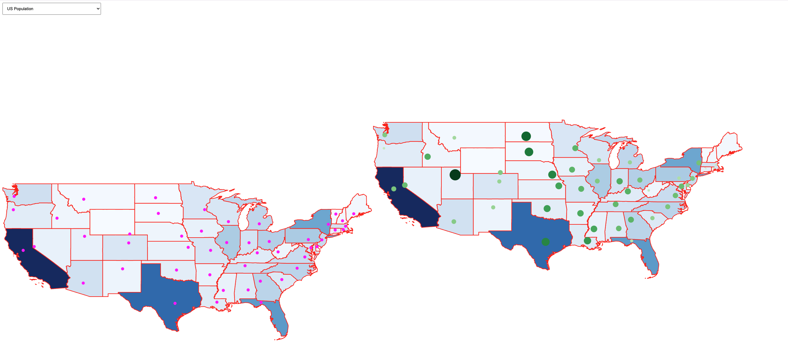

# US Map Visualization using D3.js

## **Goals**
1. Work with maps and visualize them using **D3.js**.
2. Load attributes into maps and create scales to compare attributes across regions.
3. Explore and map additional state-level attributes with bubbles for visualization.

---

## **References**
- [Geoviz Visualization Using D3](https://d3-graph-gallery.com/)
- [Reading Multiple Data Files with Promise.all](https://developer.mozilla.org/en-US/docs/Web/JavaScript/Reference/Global_Objects/Promise/all)
- Tutorial: Drawing a Map of North Carolina and Plotting Charlotte
  - **Files**:
    - `map_nc.html`
    - `nc.geojson`

---

## **Data Files**
1. **Map Data**:
   - `us_states_data.json`: GeoJSON data for US states.
   - `us_state_capitals.csv`: Locations of state capitals.
   - `us_population_by_state_2019.csv`: Population data for each state.

2. **Provided Tutorial Files**:
   - `map_nc.html`: Example code for drawing North Carolina map using **D3.js**.
   - `nc.geojson`: GeoJSON data for North Carolina.

---

## **Example Outputs**
1. US map with state capital locations visualized.

2. US map with state population visualized (colored states based on population density).

---

